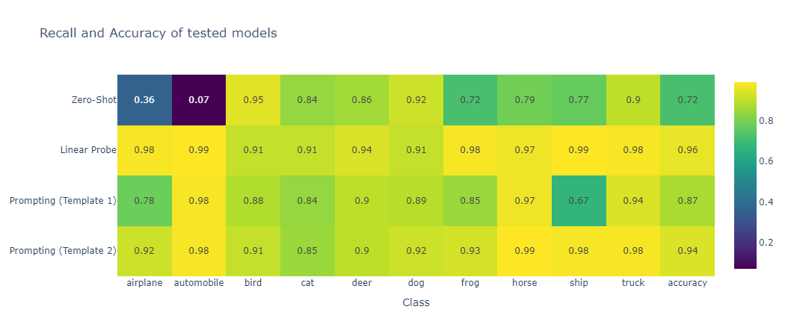

# Short research project with CLIP

## Description

This repository contains the code developed to experiment with the openCLIP model for the image classification task. Four distinct experiments were conducted to evaluate the performance of different classification strategies using the CIFAR-10 dataset:

1. **Zero-shot:** Direct classification using the text embeddings of the class names generated by CLIP.
2. **Linear Probe:** Training a shallow linear layer on top of the image embeddings extracted by CLIP, followed by evaluation.
3. **Prompting (Template 1):** Classification using the text embeddings generated by CLIP from the class names formatted with the template "A photo of `<class>`".
4. **Prompting (Template 2):** Classification using the text embeddings generated by CLIP from the class names formatted with the template "A photo of `<class>` which is a type of `<category of the object>`".

The Zero-shot and Prompting (1 and 2) experiments directly leverage CLIP's ability to align text and image representations. In contrast, the Linear Probe experiment introduces an additional training stage to adapt the image features extracted by CLIP to the specific classification task.

### Results

The results obtained in the different experiments are presented below. The table shows the per-class recall for each method (the first 10 columns), while the last column indicates the overall accuracy of the model. Additionally, a graph is included to facilitate the visualization and comparison of the performance across the different approaches.

|                        |   airplane |   automobile |   bird |   cat |   deer |   dog |   frog |   horse |   ship |   truck |   accuracy |
|:-----------------------|-----------:|-------------:|-------:|------:|-------:|------:|-------:|--------:|-------:|--------:|-----------:|
| Zero-Shot              |       0.36 |         0.07 |   0.95 |  0.84 |   0.86 |  0.92 |   0.72 |    0.79 |   0.77 |    0.9  |       0.72 |
| Linear Probe           |       0.98 |         0.99 |   0.91 |  0.91 |   0.94 |  0.91 |   0.98 |    0.97 |   0.99 |    0.98 |       0.96 |
| Prompting (Template 1) |       0.78 |         0.98 |   0.88 |  0.84 |   0.9  |  0.89 |   0.85 |    0.97 |   0.67 |    0.94 |       0.87 |
| Prompting (Template 2) |       0.92 |         0.98 |   0.91 |  0.85 |   0.9  |  0.92 |   0.93 |    0.99 |   0.98 |    0.98 |       0.94 |




## Execution Instructions

The script that summarizes the evaluation of the different models can be found in the notebook `notebooks/results.ipynb`. To execute it, the execution environment must first be prepared. Package and environment management is handled using the [`uv`](https://github.com/astral-sh/uv) tool.

### Preparation

To install `uv`, execute the following command in a Python environment:

```bash
pip install uv
```

Then, to generate the environment and install the dependencies, use:

```bash
uv sync
```

After this, you can run jupyterlab, where you will be able to execute the notebook.

```bash
jupyterlab
```

## Code Quality and Continuous Integration

This repository enforces code quality and consistency through the use of `ruff` for linting and formatting, and `pre-commit` for managing pre-commit hooks.

**ruff:** We utilize `ruff`, an extremely fast Python linter and formatter, to automatically identify and fix potential code style issues and errors. This helps maintain a clean and consistent codebase. The `ruff` configuration can be found in the `pyproject.toml` file.

**pre-commit:** To ensure that code adheres to the defined style and quality standards before it's even committed, `pre-commit` is used. This framework allows us to configure and run checks (including `ruff`) automatically on staged files. To use pre-commit locally, please install it using:

```bash
pip install pre-commit
```

Then, navigate to the repository's root directory and install the pre-commit hooks:

```bash
pre-commit install
```

Once installed, pre-commit will run automatically before each git commit. If any checks fail, the commit will be prevented until the issues are resolved.

### GitHub Actions for Continuous Integration (CI)

To guarantee that all code pushed to the repository meets our quality standards, a GitHub Actions workflow was implemented. This workflow automatically runs the pre-commit checks on every pull request and push to the repository. This ensures that only verified and compliant code is merged, maintaining the overall quality and stability of the project.

You can find the CI configuration in the .github/workflows directory.
